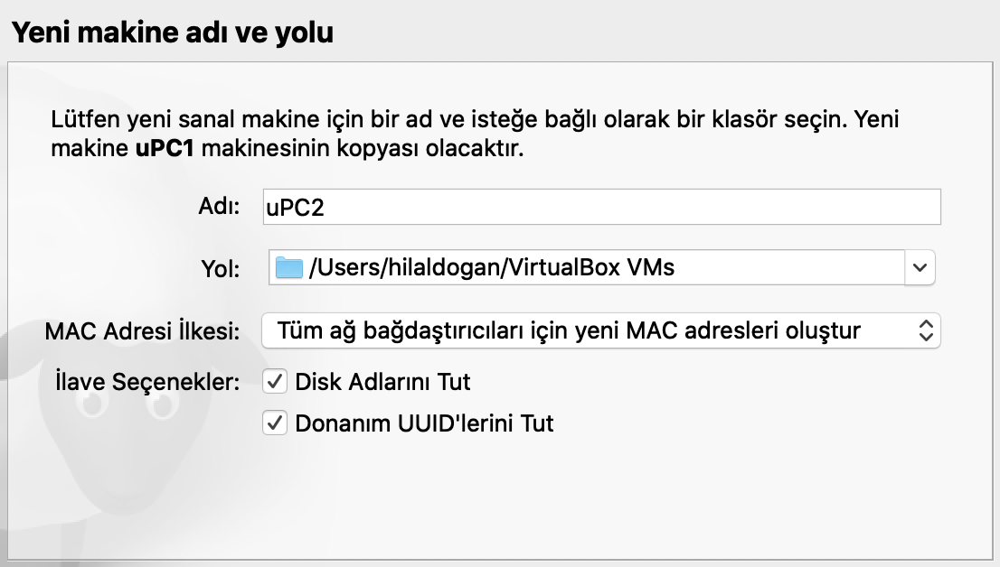
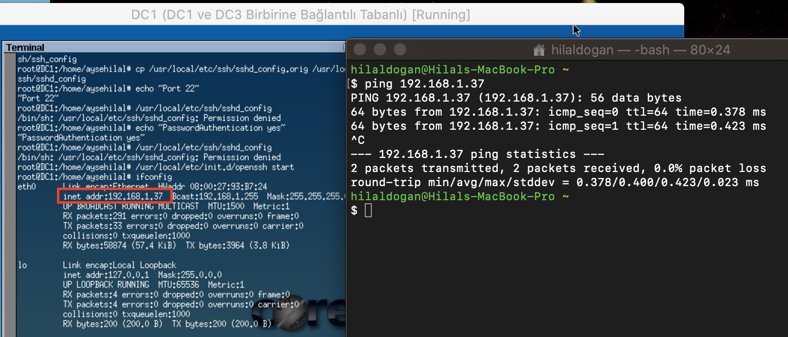
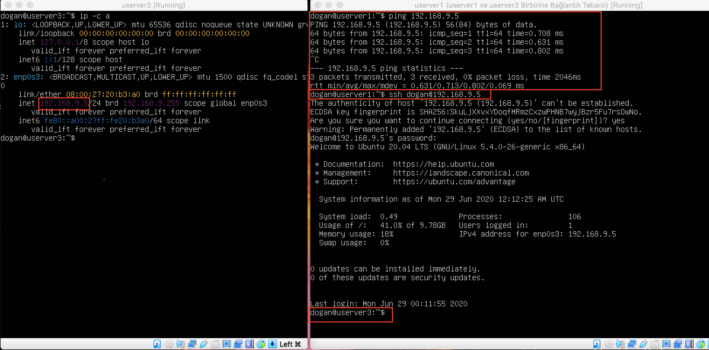

= *BLM324 LİNUX AĞ YÖNETİMİ PROJESİ*

*Ayşe Hilal Doğan*

    
    
*SENARYO 1*

*UPC1:* 
    

   
Gerekli disk ayarlamaları yapıldı. Kurulum yapılırken 10 GB’lık sanal bir sabit disk oluşturuldu ve dosya türü VDI seçildi. Fiziksel sabit diskte depolama için ‘değişken olarak ayrılan’ seçeneği seçildi çünkü eğer sabit disk olarak seçim yapılsaydı değişken olarak ayrılandan çok daha hızlı olacaktı fakat örneğin boyut olarak 30 GB seçmek istediğimde 30GB’ı baştan ayıracaktı ve değiştirilemeyecekti. Değişken olarak ayrılanda ise sadece kullanılan kısım kadarını ayırıyor ve kullandıkça ayrılan alanı büyütüyor ve bunu 30 GB’a kadar yapıyor. 

*Klonlama*

Klonlama yaparken her bir yeni sanal makine için yeni MAC adresi oluştur seçeneğini seçilir çünkü bu makinelerin birbirleri ile iletişim kurması için farklı MAC adreslerine sahip olmaları gerekir. Tıpkı yeni bir bilgisayar satın almışız gibi düşünebiliriz.

  

Çoğaltma türünü tam çoğaltma işaretleseydik tam bir kopya oluşturacaktı ve bu da çok fazla yer demek. Mesela bu dosyalar 8GB’lık yer kaplıyorsa 5 tane klonlasak 40GB demek. İşlem çok daha uzun sürer ve sanal makineye ait tüm dosyaların kopyasını çıkartır. Birbirine bağlantılı çoğaltma seçtiğimizde yeni bir sanal makine oluşturulur fakat disk dosyaları orijinal makinenin sanal sabit disk dosyalarına bağlanır ve bu sanal makineyi tek başına başka bir bilgisayara taşıyamayız.

*DC1*

  

DC1 ağ ayarları Köprü Bağdaştırıcı olarak ayarlandı.

DC1'den DC2 ve DC3 klonlandı.

*userver1*

  

userver1 ağ ayarları Dahili Ağ olarak ayarlandı.

userver1'den userver2 ve userver3 klonlandı.
    
*Senaryo 1 İsterler*

    1) Ubuntu Desktop için Ağ bağdaştırıcı ayarlarını NAT olarak ayarlayıp HOST (Kullandığınız) bilgisayardan SSH bağlantısı yapabildiğinizi (PORT yönlendirme ayarlarını yaptıktan sonra), ping yapamadığınızı gösterin. HOST bilgisayardaki dosya ismi soyadiniz.txt şeklinde olan bir dosyayı misafir (guest) işletim sistemine Misafir eklentileri yükledikten sonra kopyala yapıştır yaparak gerçekleştiriniz.

UPC1 Ağ Bağdaştırıcısı NAT olarak ayarlandı.

  
 

Gerekli PORT ayarlaması yapıldı. Burada Host Port’tan Guest Port’a erişimi açmış oluyoruz. Anamakinenin 14601 nolu portundan bir bağlantı isteği geldiğinde artık işlemle VirtualBox ilgilenir ve sanalmakinenin 22 nolu portuna yönlendirir. Ama daha önceden erişime izin verilmiş olması gerekir. 

Daha sonra ssh bağlantısı yapmak için sanal makinenin ip adresini öğrenmemiz gerekir. Bunu ip -c a komutu ile yapıyoruz (aynı zamanda renkli çıktı verir)

SSH ve Ping yapmadan önce bilgisayarın hostname'ini isterlere uygun şekilde güncelledim.
Bunun için sırasıyla aşağıdaki komutlar yazılır.

image::images/uPC1_hostname2.png[]

Reboot edilir ve hostname güncellenmiş olur.

    SSH, bir bilgisayardan başka bir bilgisayara internet üzerinden güvenli bağlantı kurmanın bir yoludur.

Ağ ayarlarını NAT olarak ayarladığımız için Host ve sanal makine arasında ssh bağlantısını port yönlendirme sayesinde yapabiliriz. 
Daha önce ayarladığımız host yönlendirme ayarına göre ssh localhost -p (host port no) -l (username) komutuyla ve bağlandığımız bilgisayarın şifresiyle SSH bağlantısı yapıyoruz. 

Burada 14601 nolu porttan istek geldiği zaman uPC1'in 22 nolu portuna yönlendirir.

Ping komutu ağ bağlantısını kontrol eder, ping atıldığında karşı taraftan geri dönüş gelmelidir. Ağ ayarları NAT olduğunda ping komutu karşılık vermez.

*.txt olan dosyayı misafir işletim sistemine kopyalama işlemi

Sanal makine üzerinden Aygıtlar -> Misafir eklentilerini yükle kısmını tamamladıktan sonra Paylaşılan Pano ve Sürükle Bırak seçeneklerini çift yönlü yapıyoruz ki hem HOST’tan Guest’e hem de Guest’ten Host’a dosya gönderimi vs yapılabilsin. 
Aşağıdaki dogan.txt dosyası Host’tan Guest’e kopyalandı.

    2) Dcore işletim sisteminin ağ bağdaştırıcı ayarlarını Köprü bağdaştırıcı olarak seçtikten sonra DC1 IP adresini bulun. SSH bağlantısı yapabilmeniz için gerekli yüklemeleri yaptıktan sonra HOST (Kullandığınız) bilgisayardan SSH bağlantısı ve ping yapabildiğinizi gösterin.
    

DC1 için Ağ Bağdaştırıcı ayarı Köprü Bağdaştırıcı olarak seçildi. 
2 tane klon (DC2, DC3) yapıldı.

Dcore için öncelikle ssh yüklemeleri yaptım.

IP adresini bulmak için ifconfig komutunu kullandım. 

Aşağıdaki resmi incelediğimizde Ping atabildiğini ve ssh bağlantısı yapabildiğini görürüz. Bunun sebebi, köprü bağdaştırıcıda host ve sanal makine arasında çift yönlü bir iletişim sağlanabiliyor olması.

    3)Ubuntu Server için yanlızca anamakine bağdaştırıcısı olarak ayarlama yaptıktan sonra IP adresini bulun. SSH bağlantısı yapabilmeniz için gerekli yüklemeleri yaptıktan sonra HOST (Kullandığınız) bilgisayardan SSH bağlantısı ve ping yapabildiğinizi gösterin. 
    
userver1 için ağ ayarları yalnızca anamakine bağdaştırıcısı olarak yapıldı.

Burada anamakine ağ yöneticisinden girip vboxnet0 ı etkinleştirdim.

Ssh yapabilmek için öncelikle ssh servisini yüklemek gerekiyor.

image::images/userver1_install_ssh.png[]

Ayarlar yalnızca anamakine bağdaştırıcısı olduğunda host ve sanal makine arasında iletişim çift yönlü sağlanabilir: Hem ssh hem ping gerçekleştirilebilir.

SSH bağlantısı için: 
ssh username@ipAdresi komutu kullanılır.

userver1'in IP'si bulunur:

Ping için:
ping ipAdresi komutu kullanılır.

userver2 ve userver3 için ise klonlama yapıldı.

userver3 clone:

*SENARYO 2*

    Numaranızın son iki rakamı S ve R olarak kabul edilmiştir. 
    userver1, userver2 ve userver3 için ağ bağdaştırıcı ayarlarını dahili ağ olarak ayarlayın. Bilgisayarların IP adreslerini statik olarak aşağıda verilen şekilde ayarlayın : 
    userver1 : 192.168.R.S
    userver2 : 192.168.R.S+1
    userver3 : 192.168.R.S+2
    Bu üç bilgisayardan birbirilerine ssh yapabildiğinizi ama HOST bilgisayardan bunlara SSH yapamadığınızı gösterin.  ping komutunu kullanarak bu bilgisayarlar arasında haberleşmelerin olduğunu gösterin.

S= 3, R=9

userver1,userver2,userver3 ağ bağdaştırıcı ayarları: 

Static ip ayarlaması için yaml dosyalarını düzenlememiz gerekir.

image::images/yaml.png[]

    userver1 için static ip:
    192.168.9.3

userver1 ip kontrol:

image::images/userver1_staticIP.png[]

    userver2 için static ip: 
    192.168.9.4

image::images/userver2_yaml.png[]

userver2 ip kontrol:

    userver3 için static ip: 
    192.168.9.5

image::images/userver2_yaml.png[]

userver3 ip kontrol:

*userverların ağ ayarlarını  dahili ağ olarak ayarladığımız için sanal makine ve host arasında bağlantı oluşmaz, sadece birbirleriyle haberleşebilirler. Birbirleri ile haberleşmeleri için hepsine aynı ismi vermemiz gerekir.(intnet)

    userver1 den userver2 ye yapılan ssh ve ping:

    
    userver1 den userver3 e yapılan ssh ve ping:

 
    userver2 den userver1 e yapılan ssh ve ping:

    userver2 den userver3 e yapılan ssh ve ping:

    userver3 den userver1 e yapılan ssh ve ping:

image::images/us3-us1_ping_ssh.png[]
    
    userver3 den userver2 e yapılan ssh ve ping:

*HOSTTAN SERVERLARA SSH VE PING*

Serverlar dahili ağ ayarlandığı için hostla haberleşemezler

    HOST'dan userver1 e başarısız ssh

    HOST'dan userver2 ye başarısız ssh

    HOST'dan userver3 e başarısız ssh

*Serverlar arası dosya gönderimi*

userver1 de oluşturduğum iki tane dosyayı, userver2'ye gönderiyorum.

userver1'de hilal.txt ve dogan.txt adlı iki dosya oluşturuyorum:

scp *.txt gondereceğinIPAdresi:/home/kullanıcıadı/ komutuyla oluşturduğum dosyaların hepsini tek seferde gönderiyorum.

Dosya göndermek istediğim yere doğru ulaşmış mı ls komutu ile kontrol ediyorum:

*SENARYO 3*

    uPC1 , uPC2 , userver1 ve userver2 için bir ağ bağdaştırıcısını NAT, diğerini dahili ağ olarak ayarlayın.uPC1 ve userver1 dahili ağ ismini dahili1, uPC2 ve userver2 dahili ağ ismini dahili2 olarak ayarlayın.
    userver1 ve userver2 için üçüncü bir ağ bağdaştırıcısını yine dahili3 olarak dahili ağ olarak ayarlayın.
    uPC1 üzerinden veri paketlerinin userver1, userver2 ve uPC2 bilgisayarlarına ayrı ayrı nasıl gittiğini gösteriniz. Bunun için uygun bir komut kullanmanızı gerekiyor. 
    

Senaryo3 için Ağ Grafiği:

uPC1 Ağ ayarları:

uPC2 Ağ ayarları:

userver1 Ağ ayarları:

userver1 NAT olarak ayarlandı port yönlendirmesi için gerekli ayar yapıldı. 

image::images/3-userver1_NAT.png[]

8888 nolu porttan istek geldiğinde 22 nolu porta yönlendirecek:

userver2 Ağ ayarları:

    

*uPC1 ve uPC2 için yaml dosyaları:*

uPC1 ve uPC2 için yaml dosyalarında tabloda belirtilen ipler verildi, diğer serverlarla haberleşebilmesi için yaml'de bir router ayarlaması yapıldı. Bunun sebebi uPC1 kendisine gelen bir ping isteğinde sadece kendi tanıdığı (örneğin 192.168.1.*) formatındaki iplere ulaşabiliyor. 

Biz router ayarını ekleyerek uPC1'e; 192.168.0.0/16 formatında bir ip'ye ulaşılmaya çalışılıyorsa, 192.168.1.254 ip si üzerinden ve enp0s8 üzerinden iletim yapmasını sağlıyoruz. 

Burada enp0s3 NAT, enp0s8 dahili2'nin bağlanacağı ip'ye karşılık geliyor.

Aynı ayarı uPC2'ye de yapıyoruz ki o da userver2 üzerinden uPC2ye ping geleceği zaman ya da başka bir yere gönderileceği zaman enp0s8 üzerinden geçerek yönlendirsin.

uPC1'den userver2'ye veya uPC2'ye (ya da tam tersi istikamette) veri paketi gönderirken routerlara da ihtiyacımız var. Burada userver1 ve userver2 yi router olarak ayarlamamız ve dahili ağ ilişkilerine göre ip vermemiz gerekir: 

Router olarak kullanabilmek için userverlara quagga yükledim.
Quagga yüklerken kopyala-yapıştır'dan faydalanmak için userver1'e guest additions ekledim ve uPC1 üzerinden userver1'e ssh bağlantısı yaparak işlemleri ubuntu desktop'da gerçekleştirdim:

Guest Additions aktifleştirme:

userver1' in düzenlenmiş ipleri:

Burada enp0s3 NAT, enp0s8 dahili1, enp0s9 dahili3 'ün bağlanacağı ip'ye karşılık geliyor.

userver2'nin düzenlenmiş ipleri:

Burada enp0s3 NAT, enp0s8 dahili2, enp0s9 dahili3 'ün bağlanacağı ip'ye karşılık geliyor.
    
uPC1'den uPC2'ye doğru olan veri gönderiminde doğru yolu izleyebilmesi için router1 ve router 2 de aşağıdaki ayarlar yapıldı: 

*Veri Paketi Gönderimi*

     uPC1 üzerinden veri paketlerinin userver1, userver2 ve uPC2 bilgisayarlarına ayrı ayrı nasıl gittiğini gösteriniz. Bunun için uygun bir komut kullanmanızı gerekiyor.

Veri paketlerinin gönderimini sağlamak ve aynı zamanda izlemek için traceroute komutu kullanılır. Bu komut veri paketlerinin izlediği yolu gösterir.

Traceroute komutunun kullanılması için önce yüklenmesi gerekir:

    sudo apt install traceroute

    uPC1'den userver1'e traceroute:

    uPC1'den userver2'ye traceroute:

    uPC1'den uPC2'ye traceroute:

